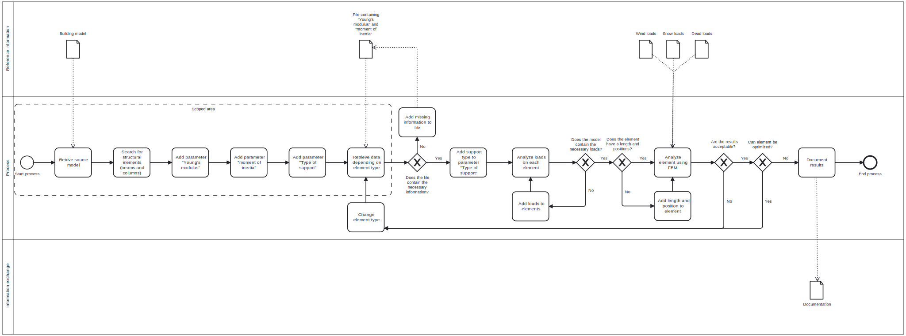

# Goal

The goal is to support the user in optimizing the building and reduce the use of material through FEM analysis.

# Model Use

Structural engineers will utilize the software for designing and optimizing beams and columns. This results in significant time and cost savings, as less material is utilized, and engineers can perform more calculations in a shorter timeframe.

# Process

## Description of Process

- **Start Process:** The first step in the process.

- **Retrieve Source Model:** The initial action where the source model of a building is retrieved for assessment. The model is most likely designed by architects through communication with the contractor.

- **Search for Structural Elements (Beams and Columns):** After retrieving the model, the next step is to identify structural elements like beams and columns within it. This is done by the structural engineer.

- **Add Parameters:** Several parameters are then added to the model's elements, depending on the type of beam or column:
  - **Young's Modulus:** This is a measure of the stiffness of a material.
  - **Moment of Inertia:** This parameter relates to the element's resistance to bending.
  - **Type of Support:** This parameter describes how the element is supported within the structure.

- **Retrieve Data Depending on Element Type:** After setting the parameters, the system retrieves additional data that's specific to the type of element in question.

  - **File Containing "Young's Modulus" and "Moment of Inertia":** There's a file check to ensure that it contains the necessary parameters.
    - If it doesn’t, add the missing information to the file.
    - If it does, proceed to the next step.

  - **Add Support Type to Parameter "Type of Support":** If the file contains the required information, the support type is added to the elements.

- **Analyze Loads on Each Element:** The model is then checked for various types of loads such as wind, snow, and dead loads.
  - If necessary, loads are missing, they are added to the element.
  - The length and positions are checked. If not available, they are added.

- **Analyzing Element Using FEM (Finite Element Method):** This step involves computational analysis to simulate how the elements behave under the various loads.

- **Results Optimization and Documentation through iteration:**
  - If the results from the FEM are not acceptable, the element type might be changed, and the analysis is run again.
  - If the element can be optimized, then optimization occurs. Otherwise, the process moves to documentation.
  - Document the results for the building model.

- **End Process:** The final step where the process is concluded after documentation is complete.

# Information Exchange

The level of detail required would be LOD 400. The reason is that we need a high enough detail level to have parameters in the elements, which will describe the material and geometry of the element as well as the location and orientation. Definitions of the properties, such as moment of inertia and Young’s modulus, are defined with buildingSMART Data Dictionary (bSDD).
