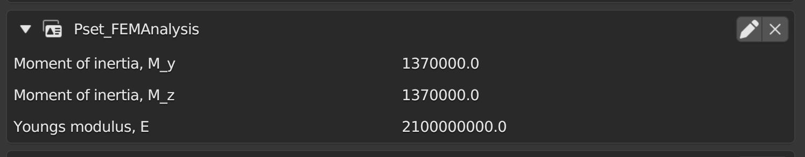

# 41934 - Advanced BIM - Group 36
Assignment A3, A4 and A5 are together here in the same repository.

[Link to A3](README.md#assignment-a3-openbim-remodel)


# Assignment A3 OpenBIM ReModel
## Introduction
The goal is to assist the user in optimizing the building and reducing material usage through FEM analysis. In this assignment, a Python script has been created to make a new property set and insert properties into an IFC file, such as the moment of inertia and Young's modulus of elasticity. These new properties are, of course, not sufficient, we also need support and actual calculations, which will be further described in the report

### Group members
Harald Lyngbye (s203615)  
Thomas Lyskjær (s203626)  
Kasper Bengtsson (s203628)


# 3A: Analyse use case
## 1
The goal of the tool can bee seen in the BIM execution plan under goal.
[Link to the goal section](BIM_ExecutionPlan.md#Goal)

## 2
The model Use  can bee seen in the BIM execution plan under model.
[Link to the model section](BIM_ExecutionPlan.md#Model)

# 3B: Propose a (design for a) tool / workflow
## 1
The IDM diagram can bee seen in BIM execution plan under process.
[Link to the Process section](BIM_ExecutionPlan.md#process)

## 2
The description of the process of your tool / workflow can also bee seen in the BIM execution plan under process
[Link to the Process section](BIM_ExecutionPlan.md#Description)


# 3D: Value What is the potential improvement offered by this tool? 

## Cost Reduction

The tool is projected to significantly reduce material costs, offering a direct financial benefit. By refining material requirements, the tool also potentially lowers secondary expenses related to logistics and handling.

## Efficiency and Productivity

Automating the FEM analysis and integrating it with BIM workflows through IFC compatibility is expected to accelerate the design process. This increment in productivity could enhance employee job satisfaction and allow businesses to reallocate resources to innovation-driven tasks.

## Competitive Edge

The capacity to deliver optimized structural designs may provide a significant competitive advantage in the market, promoting the business as a pioneer in smart construction methods.

## Risk Management

The advanced analysis capabilities of the tool will likely facilitate early detection of structural design issues, mitigating risks associated with construction errors and subsequent liability.

## Environmental Management

Material optimization directly contributes to environmental conservation by decreasing the demand for raw materials, thereby reducing the environmental footprint of construction projects.

## IFC models

The model used and the modified model are uploaded on learn due to them beeing a skylab model.

# Phyton script 
The Python script created for this assignment is designed to enhance an IFC file by inserting structural parameters such as the moment of inertia and Young's modulus of elasticity. This is achieved by creating a new PropertySet and inserting properties. For this task, a new PropertySet has been associated with a specific beam element named "Rectangular and Square Hollow Sections:SB10:2518553," bearing the global ID: 0PBox$QKjEKQwoUJvZkwUp.
## Picture of the new PropertySet in blender



## Phyton code


```python
import ifcopenshell

# Configuration Parameters
ifc_file_path = 'C:/Users/kaspervang/Desktop/overgangs semester/Advance BIM/A2/LLYN - STRU.ifc'
output_ifc_file_path = 'C:/Users/kaspervang/Desktop/overgangs semester/Advance BIM/A3/LLYN - STRU_Modified.ifc'
global_id = '0PBox$QKjEKQwoUJvZkwUp'
property_set_name = 'Pset_FEMAnalysis'
properties_to_update = {
    'Moment of inertia, M_y': 1370000,
    'Moment of inertia, M_z': 1370000,
    'Youngs modulus, E': 2100000000,
}

ifc_file = ifcopenshell.open(ifc_file_path)

element = ifc_file.by_guid(global_id)
if not element:
    print("Element not found")
    exit()


# Function to get or create property set
def get_or_create_pset(element, pset_name):
    for definition in element.IsDefinedBy:
        if definition.is_a('IfcRelDefinesByProperties'):
            property_set = definition.RelatingPropertyDefinition
            if property_set.Name == pset_name:
                return property_set
    property_set = ifc_file.createIfcPropertySet(
        GlobalId=ifcopenshell.guid.new(),
        OwnerHistory=ifc_file.by_type('IfcOwnerHistory')[0],
        Name=pset_name,
        HasProperties=[]
    )
    ifc_file.createIfcRelDefinesByProperties(
        GlobalId=ifcopenshell.guid.new(),
        OwnerHistory=ifc_file.by_type('IfcOwnerHistory')[0],
        RelatedObjects=[element],
        RelatingPropertyDefinition=property_set
    )
    return property_set

# Try to add or update property
try:
    property_set = get_or_create_pset(element, property_set_name)

    for property_name, property_value in properties_to_update.items():
        existing_property = next(
            (prop for prop in property_set.HasProperties if prop.Name == property_name),
            None
        )

        if existing_property:
            existing_property.NominalValue.wrappedValue = property_value
        else:
            nominal_value = ifc_file.createIfcReal(property_value)
            new_property = ifc_file.createIfcPropertySingleValue(
                Name=property_name,
                NominalValue=nominal_value,
            )
            properties_list = list(property_set.HasProperties) if isinstance(property_set.HasProperties, tuple) else property_set.HasProperties
            properties_list.append(new_property)
            property_set.HasProperties = properties_list

    ifc_file.write(output_ifc_file_path)

except Exception as general_exception:
    print(f"An error occurred: {general_exception}")

`````
# Assignment A4 OpenBIM Guru

## Introduction
In this assignment the goal is to teach an advanced BIM concept to our fellow students. We are looking at optimizing the structural model through a FEM analysis. In order to do this, we will need to add new parameters to the elements inside the buidling model, in order to do the actual analysis. These would include the Youngs modulus, the moment of inertia and more. We are going to be teaching you how you can add these parameters to the model through a python script, using ifcOpenShell. 

## Power point
[Link to the power point](powerpoint.pdf)

## Video
Either download the video from github.
[Link to the video](Video-groupe36.mp4)

Or play it from youtube 
https://www.youtube.com/watch?v=X-hkMR-AHVY&t=14s

## Python code

### Description of the code
As descibed in the assingment A3, the code is designed to enhance an IFC file by inserting structural parameters such as the moment of inertia and Young's modulus of elasticity. This is achieved by eather creating a new PropertySet and inserting properties or editing an exiting PropertySet. The scipt use a "try" block to make error handling efficient which was very usefull when writting the code. The code are using a library called 'ifcopenshell' which are indispensable when handling ifc files, therefore the used functions and attributes from 'ifcopenshell' are descibed below.

#### Used functions in the library 'ifcopenshell'

* ifcopenshell.open(path)  
  Open an ifc file from a path
* ifc_file.by_guid(guid)  
  Used to get an element by is guid (Global ID)
* ifcopenshell.is_a(obj, type)  
  Can check if an object is a spesefic type, used to check if a object is a property set
* ifcopenshell.guid.new()  
  Makes a new Global ID
* ifc_file.by_type(type_name)  
  Get a list of all entities of a specific type, used to set OwnerHistory,
  Which is a required parameters when making a new Propertyset.
* ifc_file.createIfcPropertySet(arguments)  
  Can create a new poperty set
* ifc_file.createIfcRelDefinesByProperties(arguments)  
  Can create relationship between elements and property sets
* ifc_file.createIfcReal(value)  
  Create a number in IFC format
* ifc_file.createIfcPropertySingleValue(name, value)  
  Can create single-value property by name and value 
* ifc_file.write(path)  
  Can save the new modefied model in a path
  

#### Used attributes in the library 'ifcopenshell'

* IsDefinedBy  
  Can access all definition associated with the element, used to get the property set of an element.
* Name  
  Can get a name of an entity
* HasProperties  
  Get the properties of a Property set, to either add or update properties
* NominalValue  
  This is an attribute that holds the value of the properties
* wrappedValue  
  This attribute is used to access or modify the underlying value of a property's   
* RelatedObjects  
  Create relationship between an element and a property set
* RelatingPropertyDefinition  
  An atribute that can takes care of the holds the property set for a element, used to check existing property set or set one. 

### The code with comments
```python

import ifcopenshell

# Configuration Parameters
ifc_file_path = 'C:/Users/kaspervang/Desktop/overgangs semester/Advance BIM/A2/LLYN - STRU.ifc'
output_ifc_file_path = 'C:/Users/kaspervang/Desktop/overgangs semester/Advance BIM/A3/LLYN - STRU_Modified.ifc'
global_id = '0PBox$QKjEKQwoUJvZkwUp'
property_set_name = 'Pset_FEMAnalysis'
properties_to_update = {
    'Moment of inertia, M_y': 1370000,
    'Moment of inertia, M_z': 1370000,
    'Youngs modulus, E': 2100000000,
}

# Open the ifc file
ifc_file = ifcopenshell.open(ifc_file_path)

# Get the element by its global ID
element = ifc_file.by_guid(global_id)

# Check if the element is found
if not element:
    print("Element not found")
    exit()


# Function to get or create property set
def get_or_create_pset(element, pset_name):
    
    # Find all definition associated with the element 
    for definition in element.IsDefinedBy:
        # Check if it is a property set
        if definition.is_a('IfcRelDefinesByProperties'):
            # Get the property set by function in ifcopenshell
            property_set = definition.RelatingPropertyDefinition
            # Check if it is the same as the one we are trying to create
            if property_set.Name == pset_name:
                return property_set
            
    
    # If there a no property set with pset_name in the element
    # Creating a new property set and assigning it a unique ID and owner history
    property_set = ifc_file.createIfcPropertySet(
        GlobalId=ifcopenshell.guid.new(),
        OwnerHistory=ifc_file.by_type('IfcOwnerHistory')[0],
        Name=pset_name,
        HasProperties=[]
    )
    
    # Link the property set to the element
    ifc_file.createIfcRelDefinesByProperties(
        GlobalId=ifcopenshell.guid.new(),
        OwnerHistory=ifc_file.by_type('IfcOwnerHistory')[0],
        RelatedObjects=[element],
        RelatingPropertyDefinition=property_set
    )
    return property_set

# Try to add or update property
try:
    property_set = get_or_create_pset(element, property_set_name)

    for property_name, property_value in properties_to_update.items():
        
        # check if the property already exisist in the property set
        existing_property = next(
            (prop for prop in property_set.HasProperties if prop.Name == property_name),
            None
        )


        if existing_property:
            # If the property exists, update its value
            existing_property.NominalValue.wrappedValue = property_value
        else:
            # Make new property and add to property set
            nominal_value = ifc_file.createIfcReal(property_value)
            new_property = ifc_file.createIfcPropertySingleValue(
                Name=property_name,
                NominalValue=nominal_value,
            )
            
            # add the new property to the list and update
            properties_list = list(property_set.HasProperties) if isinstance(property_set.HasProperties, tuple) else property_set.HasProperties
            properties_list.append(new_property)
            property_set.HasProperties = properties_list
            
            
    # Save the IFC file with the new properties
    ifc_file.write(output_ifc_file_path)

# Handling exceptions and printing an error message.
except Exception as general_exception:
    print(f"An error occurred: {general_exception}")

`````

# Assignment A5 Reflection

## Your learning experience for the concept you focused on
* Identify your own level at the beginning of this course and where you ended

In the beginning, we were modellers at levels 1-3 because we all have experience with Revit and AutoCAD and are familiar with what an IFC file is and how to export it due to work experience. We also have some experience from course “11031 Building Information Modeling” where we became familiar with Dynamo. However, this experience is very limited because none of us have used the tool since then. 

Now we fall under the categories of self learner and analyst. We are self-learners because with the understanding we have gained through the course, we will be able to import and export knowledge from OpenBIM sources and familiarize ourselves with new 'Use cases' using YouTube videos and additional learning material. 

We are analyst level 3 because we have gained an understanding of how OpenBIM works and can therefore use the acquired knowledge to analyze data from IFC files using Python, as we did in Assignment 2 and 3." 

* What else do you still need to learn

How to work with IFC files in other programs such as grasshopper, etc. We also need to learn how to use other OpenBIM sources other than Blender, such as Navisworks. It would also be relevant to work on our skills when it comes to extracting data and putting information into the IFC files, so that we can make our use case a reality.  

* How you might use OpenBIM in the future

Generally, we don't anticipate using Python or any programs that modify IFC files, given our collective goal to become structural engineers. However, we do plan to utilize OpenBIM tools for building analysis. For instance, the FE-Analysis program "FEM-Design" is capable of importing IFC files to analyze structural elements, which will be useful in our future. This course has extended our knowledge of how these programs process various parameters. It has also enhanced our understanding of the diverse professionals who use OpenBIM, showing its important role in the future of Engineering. 

## Your process of developing the tutorial 
* Did the process of the course enable you to answer or define questions that you might need later for thesis?

All three of us are planning on following a structural path, also when it comes to our thesis. Our knowledge of OpenBIM may aid us when we start working in an engineering firm later on in our lives, but for the thesis we do not see ourselves ourselves using it.  

* Would you have preferred to have been given less choice in the use cases?

Yes, sometimes the assignments were hard to understand because we were given free reins. This sometimes made it hard to get started because we didn’t really know how to start. Also, because the person who made the assignments in the first place was not present, it was sometimes hard to get the needed help. 

* Was the number of tools for the course ok - should we have more or less? - if so which ones would you leave out?

The number of tools available seemed to be okay. It is a bit hard to judge because we used the tools we were given, and made it work with those, but there might have been other tools that would have made it easier, we just don’t know it.  

## Your recieved feedback on the tutorial 
* Did the tool address the use case you identified?

The use case was to optimize the building through FEM-analysis. The tool that was created is only meant to add a few properties to the beams and columns in the model, and not to do the analysis itself. In the future it would be relevant to make an easy way to add all the properties too all the beams and columns, and based on this information, make the analysis. The only remark to the tool was that we needed to clarify where we get Young’s modulus and moment of inertia from, as we haven’t specified these are material standards.  

* Was the use case well modelled

Yes. There weren’t any difficulties in understanding what the use case was.  
  
* Was the project clearly scoped

Yes. The scope was to implement properties such as Youngs Modulus and moment of inertia for beams and columns. This was done through the python code.  

## Your future for Advanced use of OpenBIM 
* Are you likely to use OpenBIM tools in your thesis?

Currently, our group consensus is that none of us plan to incorporate OpenBIM into our thesis work. Our primary reason for choosing this course was to gain an understanding of Advanced BIM and the application of IFC files. However, there remains a possibility that one of us might eventually find a use for it.  

* Are you likely to use OpenBIM tools in your professsional life in the next 10 years?

As previously mentioned, the FE-Analysis program "FEM-Design" is capable of utilizing IFC files, and there are likely other software programs beneficial for structural engineers that also use IFC. Therefore, there's a good chance that some or all of us might use OpenBIM in our professional careers. 

## Wrap up 
* Conclude the journey through A1-A5

In our course, we tackled a series of assignments that really helped us understand IFC files. For our first assignment (A1), we opened IFC files in Excel and created dashboards for specific areas. This gave us a good start in understanding how things are connected. Then, in assignment (A2), we used Blender BIM to extract information from IFC files, which showed us how much we can do with these files. The third assignment (A3) was about putting information back into IFC files, where we saw the practical side of what we were learning. Finally, for assignment (A4), we got the chance to teach others how to use the program we developed for IFC files. Each assignment built on the last, making it a really hands-on and useful learning experience for us as students. 


